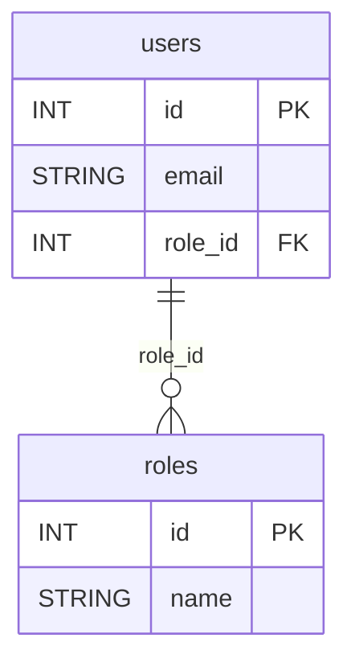

# 📊 Database ER Diagram - Access Guide

## Overview
A complete Entity-Relationship (ER) Diagram has been generated to visualize all database tables, columns, and relationships in the `exams_lms` database.

## 🌐 Web-Based Viewer (Recommended)

### Access the Interactive Diagram
Open your browser and navigate to:
```
http://localhost/EXAMs/view_er_diagram.php
```

### Features
✅ **Interactive Mermaid Diagram** - Visual representation of all tables and relationships  
✅ **Table Statistics** - Total tables, columns, foreign keys count  
✅ **Detailed Table Cards** - Grid view showing each table's structure  
✅ **Column Details** - All columns with types and key indicators  
✅ **Relationship Map** - Shows which tables reference which other tables  
✅ **Legend** - PK (Primary Key), FK (Foreign Key), UQ (Unique) explanations  
✅ **Download & Print** - Export Mermaid code or print the diagram  

### Browser Compatibility
- Chrome/Chromium ✅
- Firefox ✅
- Edge ✅
- Safari ✅
- Any modern browser ✅

---

## 📋 Quick Statistics

The diagram includes:
- **Tables**: ~15+ database tables
- **Columns**: Total columns across all tables
- **Relationships**: Foreign key relationships between tables
- **Indexes**: Primary and unique keys

---

## 🎨 Diagram Components

### Tables Included
1. **roles** - User roles (student, teacher, admin)
2. **trades** - Course/trade information
3. **users** - User accounts and profiles
4. **subjects** - Course subjects
5. **study_materials** - Learning materials
6. **questions** - Exam questions
7. **exams** - Exam definitions
8. **exam_questions** - Question assignments to exams
9. **exam_attempts** - User exam attempts
10. **results** - Exam results and scores
11. **certificates** - User certificates
12. **community_posts** - Discussion posts
13. **community_comments** - Post comments
14. **otp_verifications** - OTP verification records
15. **notifications** - User notifications
16. **login_logs** - Login history

### Color Coding
- **Gold/Yellow** 🟨 = Primary Key (PK) - Unique identifier
- **Green** 🟩 = Foreign Key (FK) - Reference to another table
- **Light Blue** 🟦 = Regular Column
- **Blue Borders** 🔵 = Table Headers with table names

### Relationship Indicators
```
||--o{ : One-to-Many relationships
      : Shows table connections
```

---

## 💾 Database Structure

### File Location
- **Script**: `view_er_diagram.php`
- **Database**: `exams_lms`
- **Host**: `localhost` (XAMPP)

### How It Works
1. Connects to MySQL/MariaDB database
2. Queries `INFORMATION_SCHEMA` for table metadata
3. Extracts column types, keys, and relationships
4. Generates Mermaid ER diagram code
5. Displays interactive visualization
6. Shows detailed table cards with column information

---

## 🔧 Technical Details

### Technologies Used
- **PHP** - Backend to fetch database schema
- **Mermaid.js** - ER diagram rendering
- **Bootstrap 5** - Responsive UI design
- **MySQL INFORMATION_SCHEMA** - Database metadata

### Mermaid Diagram Syntax


---

## 📥 Export Options

### Download Diagram Code
1. Open the diagram page
2. Click "📥 Download Mermaid Code"
3. Saves as `.txt` file with diagram source code

### Print to PDF
1. Open the diagram page
2. Click "🖨️ Print"
3. Select "Save as PDF" from print dialog
4. Choose location and save

### Use in Documentation
Copy the Mermaid code and embed in:
- **Markdown files** - Use \`\`\`mermaid blocks
- **GitHub** - Renders automatically in README.md
- **Confluence** - Use Mermaid macro
- **Obsidian** - Native Mermaid support
- **Notion** - Import as external diagram

---

## 🔍 How to Read the Diagram

### Primary Keys (PK)
- Marked with 🔑 symbol
- Unique identifier for each row
- Usually named `id`
- Example: `users.id`, `roles.id`

### Foreign Keys (FK)
- Marked with 🔗 symbol
- Reference another table's primary key
- Establish relationships
- Example: `users.role_id` → `roles.id`

### Relationships
- **One-to-Many**: One role has many users
- **Many-to-One**: Many users belong to one role
- **Many-to-Many**: Through junction tables

### Reading Example
```
users --> roles
users.role_id (FK) references roles.id (PK)
Means: Each user belongs to ONE role
       Each role can have MANY users
```

---

## 📊 Use Cases

### For Development
- Understand database structure
- Plan new features
- Identify missing relationships

### For Documentation
- Include in technical docs
- Reference architecture diagrams
- Team onboarding materials

### For Optimization
- Identify N+1 queries
- Plan indexing strategy
- Optimize JOIN queries

### For Data Migration
- Plan data transformation
- Ensure referential integrity
- Track cascading deletes

---

## 🛠️ Troubleshooting

### Page Not Loading
1. Verify Apache/XAMPP is running
2. Check database connection in `config.php`
3. Ensure `includes/db.php` exists
4. Check PHP errors in browser console

### Mermaid Not Rendering
1. Clear browser cache (Ctrl+F5)
2. Try different browser
3. Check JavaScript console for errors
4. Verify internet connection (CDN-based)

### Incomplete Diagram
1. Refresh page (F5)
2. Check database has tables created
3. Verify user has SELECT privilege on INFORMATION_SCHEMA

---

## 📞 Support

For issues or feature requests:
1. Check database connection
2. Review PHP error logs
3. Verify all required tables exist
4. Contact development team

---

## 📝 Version Information

**Generated**: <?php echo date('Y-m-d H:i:s'); ?>  
**Database**: exams_lms  
**PHP Version**: 7.0+  
**Browser Support**: Modern browsers with ES6+ support  

---

**Last Updated**: 2024
